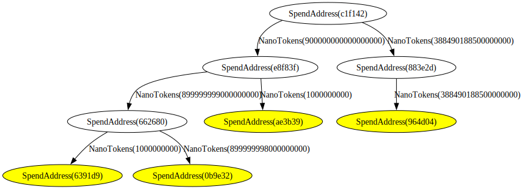

# Autonomi Network Token

The Autonomi Network Token (ANT) is a currency built on top of the storage layer of the Autonomi Network. It is used to reward Network nodes for storing data.
. ANT does not use a blockchain but a distributed Directed Acyclic Graph (DAG) of `Spend`s which are all linked together all the way to the first `Spend` which we call `Genesis`. Those `Spend`s contain transaction data and all the information necessary for verification and audit of the currency. 

## Keys

Just like many digital currencies, we use [public/private key cryptography](https://en.wikipedia.org/wiki/Public-key_cryptography) (in our case we use [bls](https://en.wikipedia.org/wiki/BLS_digital_signature) keys, implemented in the [blsttc rust crate](https://docs.rs/blsttc/latest/blsttc/)). A wallet consists of two keys:

- `MainPubkey`: equivalent to a Bitcoin address, this is used to receive ANT. It can be shared publicly. 
- `MainSecretKey`: the secret from which a `MainPubkey` is generated; it is used for spending ANT.

Unlike one might expect, the `MainPubkey` itself never owns any money: `UniquePubkey`s derived from it do. Value is owned by those `UniquePubkey`s which are spendable only once in the form of a `Spend` uploaded at that `UniquePubkey`'s address (known as a `SpendAddress`) on the Network. 

The way we obtain those `UniquePubkey`s is by using bls key derivation, an algorithm which creates a new key from another key by using a large number called a `DerivationIndex`. `UniquePubkey`s are derived from the `MainPubkey`. To spend the value owned by a `UniquePubkey`, one uses the associated `DerivedSecretKey` which was derived from the `MainSecretKey` using the same `DerivationIndex` as was used to create the `UniquePubkey`.

This `DerivedSecretKey` is used to sign the `Spend` which is then sent to the Network for validation and storage. Once the Network has stored and properly replicated that `Spend`, that `UniquePubkey` is considered to be spent and cannot ever be spent again. If more than one `Spend` entry exist at a given `SpendAddress` on the Network, that key is considered to be burnt which makes any `Spend` refering to it unspendable. 

Without the `DerivationIndex`, there is no way to link a `MainPubkey` to a `UniquePubkey`. Since `UniquePubkey`s are spendable only once, this means every transaction involves new and unique keys which are all unrelated and unlinkable to their original owner's `MainPubkey`.

Under the hood, those types are simply:

- `MainPubkey` => `blsttc::PublicKey`
- `UniquePubkey` => `blsttc::PublicKey` (derived from `MainPubkey`)
- `MainSecretKey` => `blsttc::SecretKey`
- `DerivedSecretKey` => `blsttc::SecretKey` (derived from `MainSecretKey`)
- `DerivationIndex` => `u256` (big number impossible to guess, used to derive keys)


## Spends

When a `UniquePubkey` is spent, the owner creates a `Spend` and signs it with the associated `DerivedSecretKey` before uploading it to the Network. A `Spend` contains the following information:

```rust
pub struct Spend {
    pub unique_pubkey: UniquePubkey,
    pub ancestors: BTreeSet<UniquePubkey>,
    pub descendants: BTreeMap<UniquePubkey, NanoTokens>,
}
```

A `Spend` refers to
- its own `UniquePubkey`
- its `ancestors` (which refer to it as a one of the `descendants`)
- its `descendants` (which could refer to it as one of the `ancestors`)

> Note that `ancestors` and `descendants` should not be confused with inputs and outputs of a transaction. If we were to put that in traditional input output terms:
> - The `ancestors` are the inputs of the transaction where `unique_pubkey` is an output.
> - The `unique_pubkey` is an input of the transaction where `descendants` are an output.

```go
         GenesisSpend
            /   \
       SpendA    SpendB
        /  \         \
   SpendC  SpendD    SpendE
    /        \          \
...          ...         ...
```

> All the `Spend`s on a Network come from Genesis.

Each descendant is given some of the value of the spent `UniquePubkey`. The value of a `Spend` is the sum of the values inherited from its ancestors. 

```go
               SpendS(19)                       value
              /    |    \                         |
             9     4     6                   value inherited
            /      |      \                       |
     SpendW(9)  SpendX(4)  SpendY(6)            value
       /     \     |                              |
      6       3    4                         value inherited
     /          \  |                              |
SpendQ(6)        SpendZ(7)                        V

```

> In the above example, Spend Z has 2 ancestors W and X which gave it respectively `3` and `4`. 
> Z's value is the sum of the inherited value from its ancestors: `3 + 4 = 7`.
>
> In this example `SpendW` of value `9` would look something like:
> ```
> Spend {
>    unique_pubkey = W,
>    ancestors = {S},
>    descendants = {Z : 3, Q : 6},
> }
> ```

`Spend`s on the Network are always signed by their owner (`DerivedSecretKey`) and come with that signature: 

```rust
pub struct SignedSpend {
    pub spend: Spend,
    pub derived_key_sig: Signature,
}
```

In order to be valid and accepted by the Network a Spend must:
- be addressed at the `SpendAddress` derived from its `UniquePubkey`
- refer to existing and valid ancestors that refer to it as a descendant
- refer to descendants and donate a non zero amount to them
- the sum of the donated value to descendants must be equal to the sum of the Spend's inherited value from its ancestors
- the ancestors must not be burnt

> If multiple valid spend entries are found at a single address, that `UniquePubkey` is said to be burnt and its descendants will therefore fail the above verification
> ```go
>            SpendA
>             /   \
>        SpendB    (SpendD, SpendD)
>         /            \        \
>       ...            [E]      [F]
> ```
> In the figure above, there are two `Spend` entries in the Network for the `UniquePubkey` `D`. We say that `D` is burnt. The result is that `E` and `F` have a burnt parent making them unspendable. 
> When fetching `D`, one would get a burnt spend entry as we have two `Spend`s on the Network at that `SpendAddress`:
> ```
> Spend {
>    unique_pubkey = D,
>    ancestors = {A},
>    descendants = {E : 3},
> }
> Spend {
>    unique_pubkey = D,
>    ancestors = {A},
>    descendants = {F : 3},
> }
> ```

`Spend`s are the only currency related data on the Network, they are stored in a sharded manner by nodes whose address is close to the `UniquePubkey`. This ensures that any other `Spend` with the same `UniquePubkey` is the responsibility of the same nodes, countering knowledge forks. 


## Spend DAG

All the spends on the Network form a DAG of `Spend`s, with each `Spend` stored in different locations on the Network. No single node has the entire knowledge of the DAG, but the Network as a whole contains that DAG. 

The Spend DAG starts from Genesis, and by following its descendants recursively, one can find all the `Spend`s on the Network. 

An application collecting all those spends from Genesis could rebuild the DAG locally and use it for auditing or external verification. There is no need to run a node to download the entire DAG as the `Spend`s can be fetched for free by a Network client. Similarly to how blockchains have block explorers, a DAG explorer could be built using this. 

The figure below is an example output of such a DAG collecting application:




## Transfers

To perform a `Transfer`, one must have money to spend: own at least a spendable `UniquePubkey` and the key to spend it: 
- either the `UniquePubkey`'s secret `DerivationIndex` and the `MainSecretKey` in order to derive the `DerivedSecretKey`
- or just the `DerivedSecretKey`s that owns that `UniquePubkey`

The `Transfer` needs an amount and a recipient: a `MainPubkey`. All the amounts on the Network are in `NanoTokens`, the smallest unit of ANT (10^-9 ANT). Think of it as the ANT equivalent to Satoshi for Bitcoin or Wei for Ethereum. 

> The following concepts are used in the performing of a transfer:
> - `UniquePubkey`: a unique key that can own money but only be spent once
> - `Spend`: the spend commitment of a `UniquePubkey`, once uploaded to the Network, that key is considered to be spent, if a key is spent more than once, it is considered to be burnt and its descendants unspendable
> - `CashNote`: a package of information associated with a `UniquePubkey`: simplifies the process of creating a `Spend` from it
> - `CashNoteRemption`: the minimal information necessary for a recipient to identify a received `UniquePubkey` and be able to spend it
> - `Transfer`: an encrypted package of `CashNoteRemption`, destined to the recipient

A Transfer consists of the following steps:

#### Preparation

First we need to decide on the transfer's recipient and amount:

- decide on a recipient: `MainPubkey` and an amount in `NanoTokens`

Then we gather our local spendable `UniquePubkey`s:

- gather spendable `UniquePubkey`s we own that make up that amount or more
- gather the ancestors of our `UniquePubkey`s as we need them in the `Spend`

> All the information regarding a spendable `UniquePubkey` (except for the secret keys) can conveniently be packed together into what we call a `CashNote`:
> ```rust
> pub struct CashNote {
>     pub main_pubkey: MainPubkey,
>     pub derivation_index: DerivationIndex,
>     // note that MainPubkey + DerivationIndex => UniquePubkey
>     pub parent_spends: BTreeSet<SignedSpend>,
> }
> ```

Then, to protect the identity of the recipient on the Network, we derive a completely new `UniquePubkey` from the recipient's `MainPubkey` using a randomly generated `DerivationIndex`. From an third party's eye, that `UniquePubkey` is unlinkable to the `MainPubkey` we're sending money to. The result is that only the sender and the recipient know that they are involved in this transfer. 

- creation of `UniquePubkey`(s) for the recipient by deriving them from the recipient's `MainPubkey` with randomly generated `DerivationIndex`(es)

With all the above data, we can finally create the `Spend`s which represent the sender's commitment to do the transfer.

- creation of the `Spend`s for each spent `UniquePubkey`
    - `unique_pubkey`: `UniquePubkey` we own that we wish to spend
    - `ancestors`: reference to the ancestors of that `UniquePubkey` to prove its   validity
    - `descendants`: reference to the `UniquePubkey`(s) of the recipient(s)

> Note that the `Spend` does not contain any `DerivationIndex`es nor does it contain any `MainPubkey`s. This makes `Spend`s unlinkable to any of the involved parties. 

```go
// we own:
-> UniquePubkey_A of value (4)
-> UniquePubkey_B of value (5)
// we send to:
-> NewUniquePubkey = RecipientMainPubkey.derive(RandomDerivationIndex)
```

#### Commitment

- sign each `Spend` with the `DerivedSecretKey` that we derive from `MainSecretKey` with that `Spend`'s `UniquePubkey`'s `DerivationIndex`
- upload of the `SignedSpend`s to the Network

> After this step, it is not possible to cancel the transfer.

```go
 ParentSpendA(4)   ParentSpendB(5)    <- spends on the Network
           \           /
            4         5
             \       /
          NewUniquePubkey(9)          <- refering to this yet unspent key
```

#### Out of Band Transfer

At this point, the recipient doesn't yet know of: 
- the `Spend`(s) we uploaded to the Network for them at `SpendAddress`
- the `UniquePubkey`(s) we created for them which can be obtained from the `DerivationIndex`

> Note that `SpendAddress`: the network address of a `Spend` is derived from the hash of a `UniquePubkey`

We send this information out of band in the form of an encrypted `Transfer` encrypted to the recipient's `MainPubkey` so only they can decypher it. 

> Since the `Transfer` is encrypted, it can be sent safely by any chosen media to the recipient: by email, chat app or even shared publicly on a forum. 
>
> If the encryption is ever broken, this information is unusable without the recipient's `MainSecretKey`. However, coupled with the recipient's `MainPubkey`, this information can identify the corresponding `UniquePubkey`s that were received in this `Transfer`.

An encrypted `Transfer` is a list of `CashNoteRedemption`s, each corresponding to one of the received `UniquePubkey`s:

```rust
pub struct CashNoteRedemption {
    pub derivation_index: DerivationIndex,
    pub parent_spends: BTreeSet<SpendAddress>,
}
```

It contains the `DerivationIndex` used to derive:
- the `UniquePubkey` that we're receiving from our `MainPubkey`
- the `DerivedSecretKey` from our `MainSecretKey`: needed to spend this new `UniquePubkey`

#### Redemption and Verification

Once received and decrypted by the recipient, the `CashNoteRedemption` can be used to verify the transfer using the `Spend`s online and add the received `UniquePubkey`s to our spendable `UniquePubkey`s stash:

- getting the `UniquePubkey` from the `CashNoteRedemption`'s `DerivationIndex` and our `MainPubkey`
- getting the `Spend`s at the `SpendAddress` on the Network provided in the `CashNoteRedemption` and making sure they all exist on the Network
- verifying the content of those parent `Spend`s
    - make sure they all refer to our `UniquePubkey` as a descendant
    - make sure they are valid `Spend`s
- the `UniquePubkey` is now ours and spendable!
- for convenience, one can create a `CashNote` with all the above information to simplify spending the received `UniquePubkey`

> Since `CashNote`s contain sensitive information, they should never be shared or leaked as it would reveal the link between the `MainPubkey` and the `UniquePubkey` of this `CashNote`

Once successfully received, for safety, it is advised to re-send the received tokens to ourselves on a new `UniquePubkey` that only we can link back to our `MainPubkey`. This ensures:
- that the original sender doesn't have the `DerivationIndex` for our spendable money
- that we know the parent of our spendable `UniquePubkey`s are not burnable by anyone but ourselves

> Failing to do so exposes the receiver to the risk of having their keys become unspendable if the sender decides to burn the parent `Spend`s

```go
 ParentSpendA(4)   ParentSpendB(5)    <- spends on the Network
           \           /
            4         5
             \       /
             NewSpend(9)              <- spend on the Network
                 |
                 9
                 |
        AnotherUniquePubkey(9)        <- refering to this new unspent key
```

After this final step, the transaction can be considered settled, and we have reached finality.

```

recipient                       sender                  Network
    |                              |                       |
    | ----- share MainPubkey ----> |                       |
    |                              |                       |
    |                              | --- send Spends ----> |
    |                              |                       |
    | <---- send Transfer -------- |                       |
    |                                                      |
    |                                                      |
    | ------------ verify Transfer ----------------------> |
    |                                                      | <- at this point
    |                                                      |    the tx is settled
    | ------------ send Spend to reissue to self --------> |
    | ------------ verify spends ------------------------> |
    |                                                      |
      ===================== finality =====================   <- at this point 
                                                                the funds are safe

```

## Wallet

Any wallet software managing ANT must hold and secure:
- the `MainSecretKey`: password encrypted on disk or hardware wallet (leaking it could result in loss of funds)
- the `DerivationIndex`es of `UniquePubkey`s it currently owns (leaking those could result in reduced anonymity)
- the ancestry data (parent spends) for each `UniquePubkey`s in order to build the `Spend`s for each of them

After spending a `UniquePubkey`, the wallet should never spend it again as it will result in burning the money. 

After receiving a `Transfer`, it should:
- verify that the ancestor spends exist on the Network and are valid
- reissue the received amount to a new `UniquePubkey` by spending the received money immediately. This is necessary to prevent the original sender from burning the ancestors spends which would result in the recipient not being able to spend the money
- verify that it didn't do the reissue above already to avoid burning its own money

All `DerivationIndex`es should be discarded without a trace (no cache/log) as soon as they are not useful anymore as this could result in a loss of privacy. 

